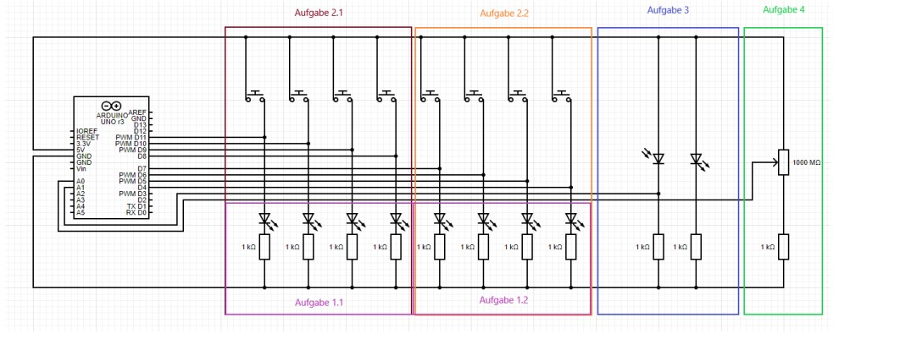
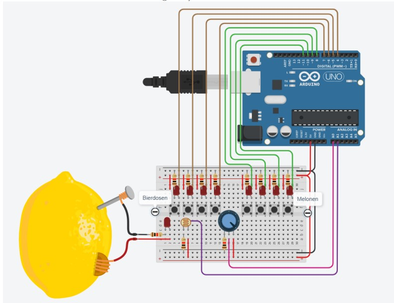

# Arduino-Based Smart Fridge Monitoring System

This project demonstrates the development of a smart fridge control system using an Arduino platform. The system is designed to monitor the contents of a refrigerator by tracking item levels with the help of various sensors. The collected data is then displayed in real-time through the Arduino Serial Monitor, simulating a smart fridge functionality that can be expanded further for real-world applications.

## Technologies Used
- **Arduino Uno**: The microcontroller that serves as the core of the system, handling inputs from sensors and controlling outputs.
- **LEDs**: Used as visual indicators to represent the status and levels of items inside the fridge.
- **Photoresistors and Potentiometers**: Sensors used to detect the presence of items and simulate changes in quantity, such as the liquid level in a bottle.
- **C Programming for Arduino**: Provides the control logic and instructions for data acquisition and output.
- **Arduino Serial Monitor**: Displays real-time data on item levels, simulating an inventory management system for the fridge.

## Key Features
- **Real-time Monitoring**: Sensors detect item levels, such as whether a product is present and how full it is (e.g., liquid in a bottle).
- **LED Status Indicators**: LEDs visually indicate the current status of the fridge's contents, offering a simple, intuitive interface for users.
- **Data Output via Serial Monitor**: The fridge’s inventory is tracked and displayed through the Arduino Serial Monitor, showing detailed information on the number and status of items in real-time.
- **Simulated Sensor Interactions**: A potentiometer is used to simulate changes in item quantities, while photoresistors detect the presence or absence of products.

## System Architecture
The circuit layout demonstrates how the Arduino is connected to the sensors and LEDs. Each component plays a specific role in tracking and displaying item levels, simulating a smart appliance setup. The system is flexible and scalable, allowing for the integration of additional sensors or functionality for future development.

## How to Run the System
1. **Connect Components**: Set up the Arduino Uno with the sensors and LEDs according to the circuit diagram provided.
2. **Upload Code**: Use the Arduino IDE to upload the control code to the microcontroller.
3. **Open Serial Monitor**: Launch the Arduino Serial Monitor to observe real-time updates on the fridge’s contents, including the current status and levels of the items.

## Future Enhancements
- **Temperature Monitoring**: The system can be expanded to include temperature sensors for monitoring fridge conditions.
- **Mobile Integration**: Implement a mobile app to track fridge contents remotely and receive notifications when items are low.
- **Automated Ordering**: Develop a feature to automatically generate a shopping list or order items when stock is depleted.
